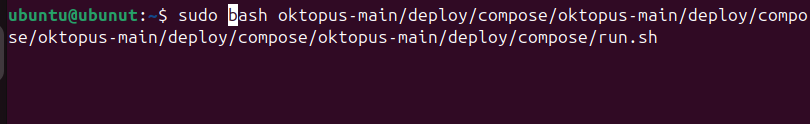
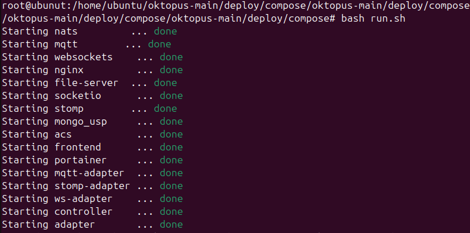
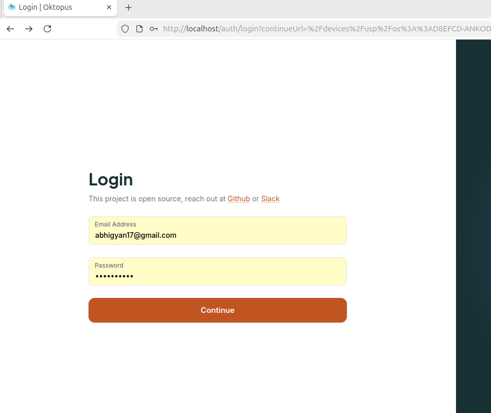
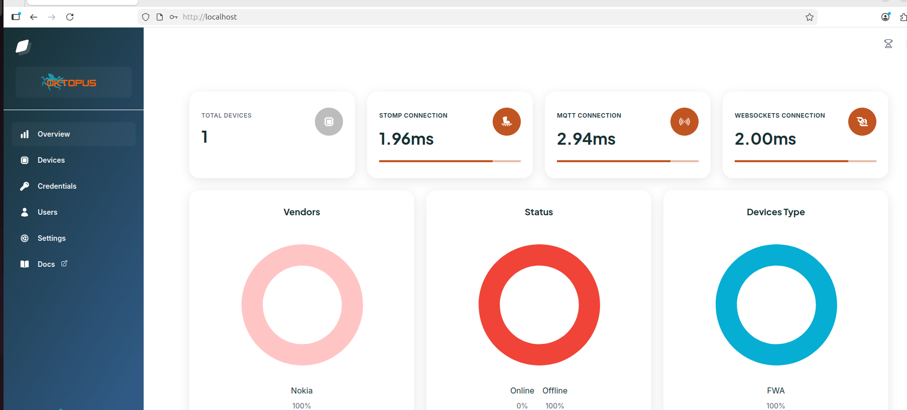
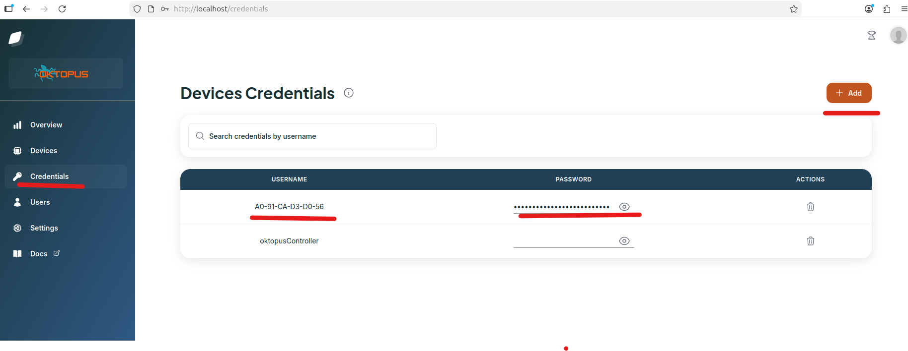
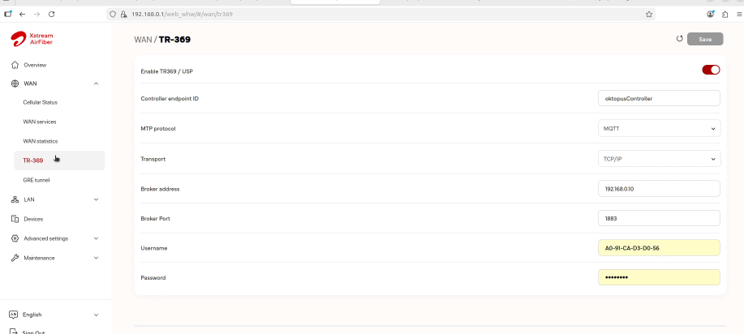
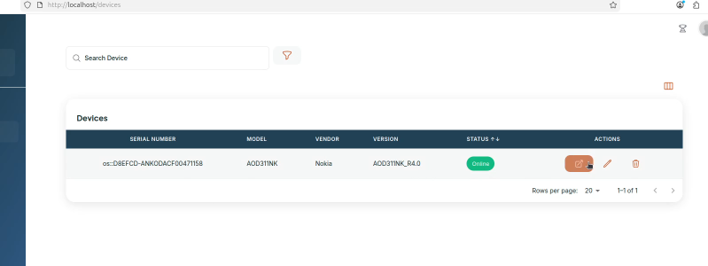
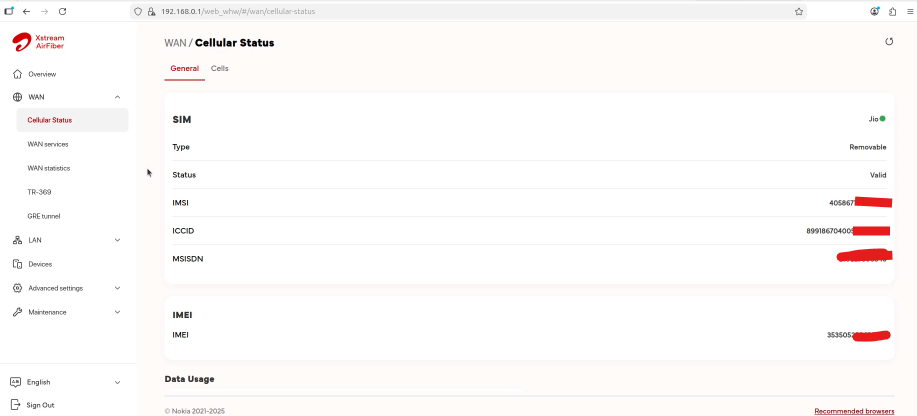

# Airtel Nokia Fastmile TR-369 Configuration & VM Setup

Hey everyone! Here is the complete guide to getting your Ubuntu TR-369 Oktopus VM up and running, so you can connect to your Nokia Fastmile ODU. We will go step-by-step.

<b>1. Getting the Virtual Machine Ready</b>
First things first: you will need the actual VM image. I have uploaded the compressed file to MEGA so it is easy to grab. You can download it right here: 
https://mega.nz/file/ahJE0YgY#42sXhzKcle7z7m9H3tFgD1UHcp_sRkr6PF0GexlJMas

Once you have downloaded it, extract the .7z archive into this folder. Inside, you will see a file named Ubuntu_tr369_octopus.vmdk and a folder named Ubuntu_tr369_octopus. 

If you do not already have VMware installed (like Workstation Player or Pro), make sure you download and install that first. After that, just open the Ubuntu_tr369_octopus folder and double-click the .vmx configuration file. VMware will automatically launch and boot up the virtual machine for you!

<b>2. Starting the Oktopus Server</b>
When the VM boots up, just log in with these credentials:
Username: ubuntu
Password: ubuntu

Once you are in, open up the terminal because we need to spin up the Docker containers. Run these commands:
cd oktopus-main/deploy/compose/
sudo bash run.sh 

Now just give Docker a moment to start everything up. Once it is ready, open your web browser and go to:
http://localhost

You should see the Oktopus login screen:

Log in using the default admin account:
Email: abhigyan17@gmail.com
Password: Asdf@12345

After logging in, you will be greeted by the main dashboard:
  

<b>3. Setting up the Controller Device</b>
Now it is time to create the credentials for your controller device. Head to the credential screen:

For the username, use the exact MAC address of your ODU. For the password, just generate any long, random string you want.

<b>4. Networking and Subnetting (Crucial Step!)</b>
This part is crucial: your device and the TR-369 server absolutely have to be on the same subnet, otherwise they will not talk to each other.

To get around this, I used an Ethernet-to-USB adapter and physically connected the VM directly to the device. Then, I changed the IP address of the server so that it matched the device's exact subnet. Be sure to put in that random password you generated in the previous step onto the device side as well.

Once the device is physically connected and configured, wait about 5 to 10 minutes. It takes a little while for the device to register itself with the server. Once it does, it will pop up on your screen like this:

Voila! You now have full access to the device and can perform whatever operations you need!

Proof of Concept:

If you want to see an actual visual walkthrough of all this, I have explained the whole process in my video here:
https://www.youtube.com/watch?v=uKLA3_eHgwY&lc=Ugyx3nYiZUzn4GdEmnx4AaABAg

Resources & Connect with Me:

GitHub Repository: https://github.com/abhigyan17/JioAirfiber_Unlock
Discord Server: https://discord.gg/Pk473Ccyw
X (Twitter): https://x.com/hacksmith_abhi
LinkedIn: https://www.linkedin.com/in/abhisheksharma1992/  
Business and Collaboration Email: abhigyan17@gmail.com

#AirtelAirFiber #NokiaFastMile #HardwareHacking #NetworkSecurity #TechnicalReport369 #OpenWirelessRouter #HacksmithTechZone #FifthGenerationRouter #technologytutorial #jioairfiber #jio5g #airtel5g #airtelindia